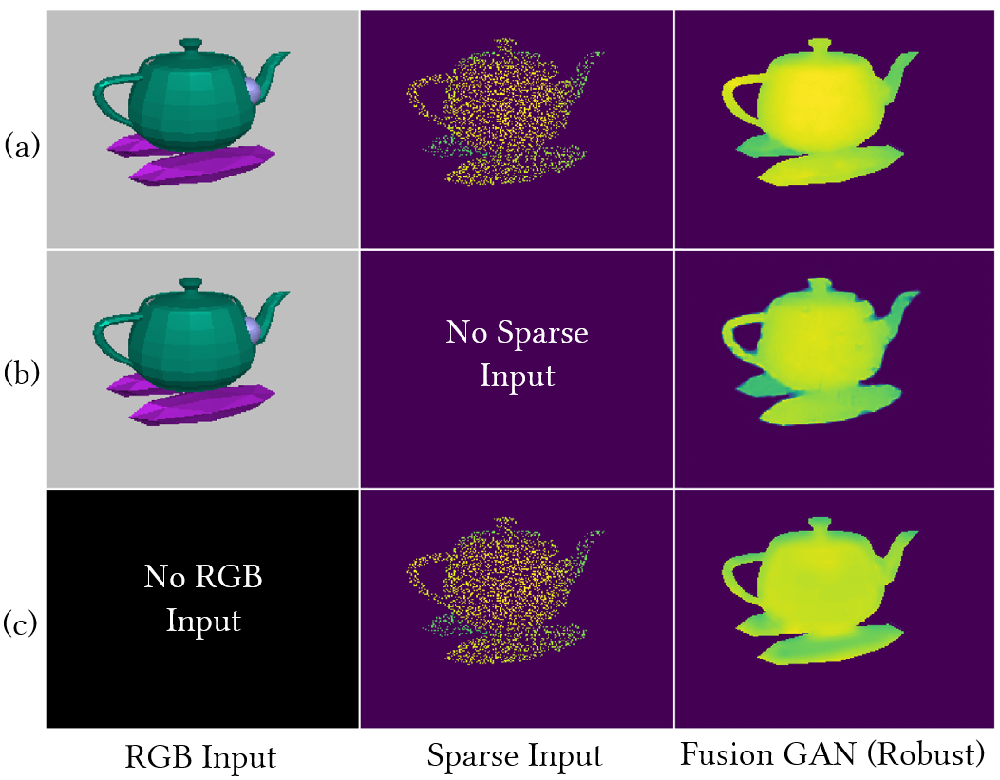

# Robust Multimodal Fusion GAN

This repo is the PyTorch implementation of our ACM Multimedia'22 paper on [Robust Multimodal Depth Estimation using Transformer based Generative Adversarial Networks](https://dl.acm.org/doi/abs/10.1145/3503161.3548418)

<p align="center">
	
</p>

## Requirements
The base environment(python 3.6) consists of:
```
pytorch == 1.10.2
torchvision == 0.11.3
tensorboard == 1.15
py-opencv == 4.5.5
pillow == 8.4.0
numpy == 1.17.4
typing == 3.6.4
```

## Dataset
Primarily two datasets were used [ShapeNet](https://shapenet.org/) and [NYU_v2](https://cs.nyu.edu/~silberman/datasets/nyu_depth_v2.html)

## Training
```
python train.py --model nyu_modelA --gpus=0,1 --batch_size=40 --n_epochs=27 --decay_epoch=15 --lr_gap=3 -p chkpts/nyu_modelA.pth -n nyu_modelA_train
```
1. -n --> give a name to the run
2. Modify the val dataloader path with appropriate data directory
3. Typically the directory has the following structure
```
    ----|->data.nyu_v2|
                      |->train|
                              |->sparse_depth
                              |->depth_gt
                              |->image_rgb
                              |->meta_info.txt
                      |->val|
                            |->sparse_depth
                            |->depth_gt
                            |->image_rgb
                            |->meta_info.txt
                      |->sample|
                               |->sparse_depth
                               |->depth_gt
                               |->image_rgb
                               |->meta_info.txt
```
4. The "depth_gt" and "sparse_depth" are the folders containing dense and sparse depth respectively
5. The meta_info.txt contains the file names of these folders. Refer to misc/ folder for sample meta_info file
6. The folder "sample" contains a few sparse samples. This is to track the model learning visually. This is optional.

 
## Validation
You can run standalone validation if you have a trained model. For that the checkpoint model path has to have 2 files named generator_best.pth and discriminator_best.pth. You can invoke the validation script by:
```bash
python validate.py --model nyu_modelA --gpus=0 --batch_size=16 --checkpoint_model=./logdir/nyu_train/saved_models/ -n nyu_test
```
## Misc
For convenience, some helping scripts have been provided in the misc\ folder
```
├── meta_info.txt       #example meta_info file
```

## Citation
If you found the repository helpful, please cite using the following:
```
@inproceedings{10.1145/3503161.3548418,
author = {Khan, Md Fahim Faysal and Devulapally, Anusha and Advani, Siddharth and Narayanan, Vijaykrishnan},
title = {Robust Multimodal Depth Estimation Using Transformer Based Generative Adversarial Networks},
year = {2022},
isbn = {9781450392037},
publisher = {Association for Computing Machinery},
address = {New York, NY, USA},
url = {https://doi.org/10.1145/3503161.3548418},
doi = {10.1145/3503161.3548418},
booktitle = {Proceedings of the 30th ACM International Conference on Multimedia},
pages = {3559–3568},
numpages = {10},
keywords = {sensor fusion, depth completion, generative adversarial nertworks (gan), multimodal sensing, robustness, sensor failure},
location = {Lisboa, Portugal},
series = {MM '22}
}
```

## Acknowledgement
This work was supported in part by National Science Foundation (NSF) SOPHIA (CCF-1822923) and Center for Brain-inspired Computing (C-BRIC) & Center for Research in Intelligent Storage and Processing in Memory (CRISP), two of the six centers in JUMP, a Semiconductor Research Corporation (SRC) program sponsored by DARPA.
